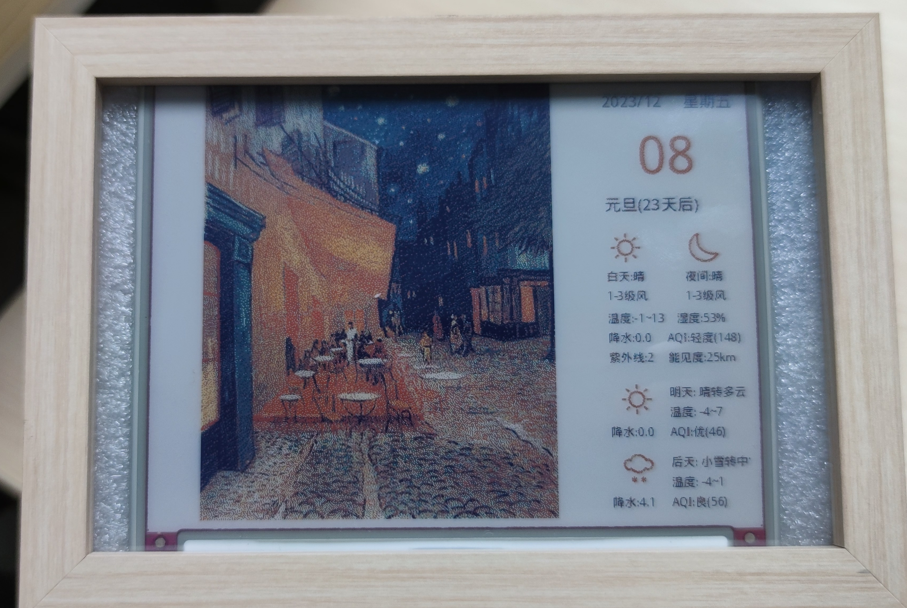
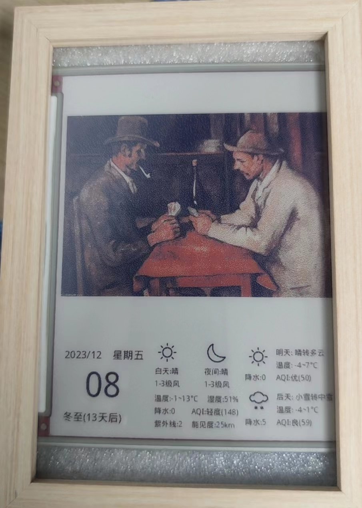
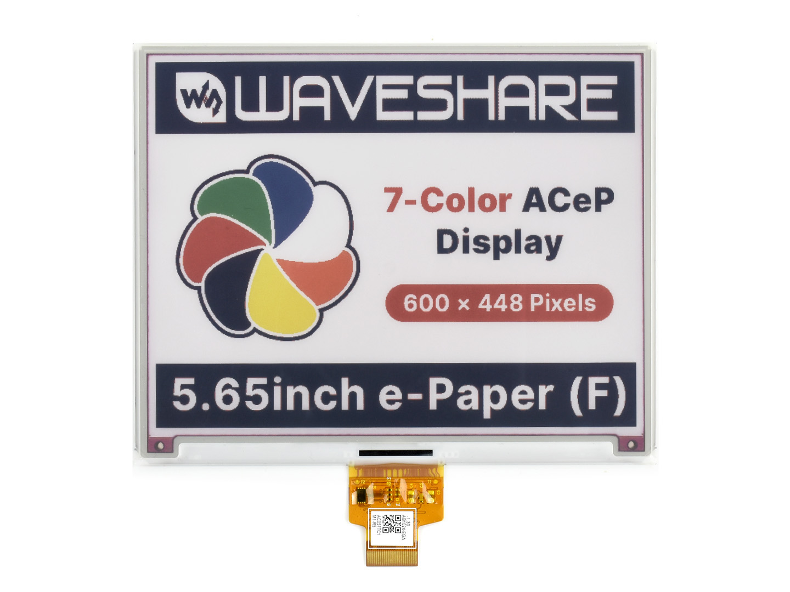
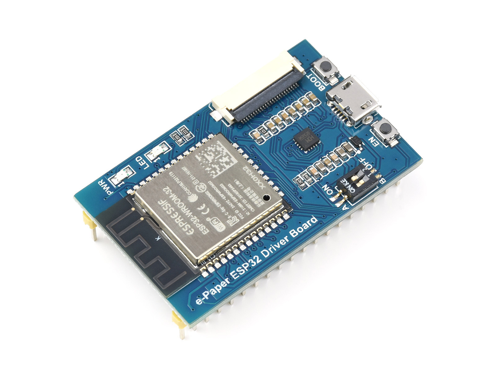
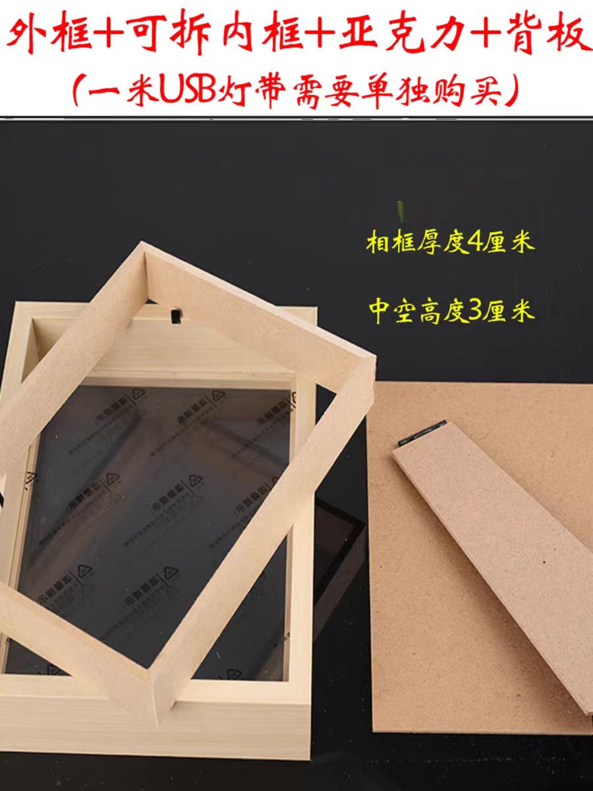
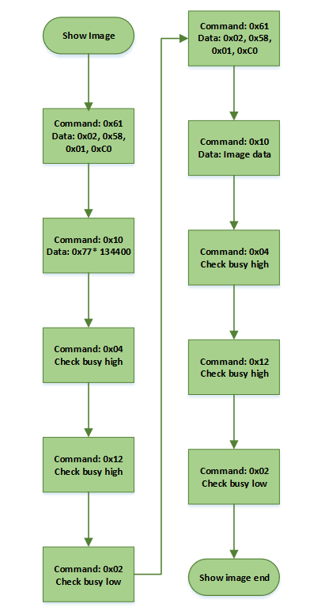

## 1. 简介

最近整了台NAS，发现最近拍了很多照片，都丢在硬盘里吃灰很可惜，于是想着再弄个电子相册出来。正好不久前在少数派看到大佬做了个[电子日历](https://sspai.com/post/82704)，于是果断抄个作业。但众所周知啊，抄作业这个事，抄完之后得改点，防止被老师发现是一回事，更重要的是大佬的作业会跳步骤，关键点写上了然后“显然”一下就直接出答案了，这没法抄啊🥲……

所以讲一下不同点，首先在硬件（和README）方面几乎照抄了[westqzy's eInk-calendar](https://github.com/westqzy/eInk-calendar)，不同之处在于作为一个电子相册用黑白的屏幕着实不太合适。在软件上沿用了[凉糕大佬](https://sspai.com/post/82704)的C/S架构，即墨水屏终端只负责接收最终需要显示的图片数据，基础数据的获取与处理在服务端上完成，而不同之处在于我直接用python完成了服务端的全部工作（主要是就显示个照片再带点天气啥的，不需要和其他pipeline联动）。

我的主要思路是服务端维持一个照片队列，每天定时生成数张日历图像，我这里设置的是凌晨3点和下午3点：早上上班前和晚上回家后能看到不同的照片就够了。照片队列以文本的形式保存照片的路径，队列初始化时从图像库中随机抽取一定数量的横向/竖向照片供本周使用，我觉着每周手动转置一次相册可能会比较有仪式感。此外我可以通过手动编辑的方式安排未来显示的照片，有利于发送彩蛋。此外还给服务端做了个简单的上传功能，可以直接上传一张图像并且添加到队列头部。**注意：没做任何安全检查，http.server直接把数据给PIL保存了，所以绝对不要把这个服务暴露在公网**

墨水屏终端启动向服务端发送请求，从服务端获取下一张图像的hash，如果与已显示的图像不同则请求图像数据并更新墨水屏，最后请求墨水屏终端深度睡眠的唤醒时间，这里则是希望墨水屏终端能在服务端生成新日历图像后10分钟唤醒。特别的，墨水屏终端上电后会立刻进行一波更新，而联网失败/没有得到hash/没有得到新数据/没有得到唤醒时间则深度睡眠一小时后再次执行更新。

此外，墨水屏终端没有设置自动配网，ssid和密码都是硬编码在config里的，我目前的思路是这个设备部署之后就和内网中的服务器绑定了，完全没有必要重新配置网络。但这样抄作业就必须自己费劲配置ESP32的开发环境了，未来有需求的话我可能会更新一下吧……

最终成品长这样：

## 2.硬件方案

硬件上总体如下：

### 屏幕

来自微雪的[5.65inch e-Paper Module (F)](https://www.waveshare.net/wiki/5.65inch_e-Paper_Module_(F)_Manual#ESP32.2F8266)，分辨率600 × 448 ，外形尺寸125.4 × 99.5mm × 0.91mm.

> 对，我知道微雪还有个7.3inch的彩色屏幕，也有大佬把STM32的驱动移植给ESP32了。但这个驱动没开源，我不敢冒险自己重写驱动，毕竟这屏幕不太便宜……
> 微雪没有提供7.3inch彩色屏幕的驱动和例程。但有个7.3inch成品相册能够显示TF卡中存储的照片，不想手搓/没有联网更新需求的朋友可以直接和钱包商量一下。

### 计算单元

为了方便同样选自来自微雪的[E-Paper ESP32 Driver Board](https://www.waveshare.net/wiki/E-Paper_ESP32_Driver_Board)，这是一款电子墨水屏无线网络驱动板，板载ESP32，支持Arduino开发。

最初是考虑过使用树莓派Zero搭配7.3inch的彩色屏幕的（有驱动有例程），但跑一个完整系统的树莓派的功率还是太高了，我并不希望需要时刻惦记电子相册是否需要充电和是否有效散热。

### 电源

可以通过电脑上的USB接口用micro USB线直接通过开发板来进行供电和调试工作。这里是使用了一个带电量显示的锂电池，卖家称外接设备时电量显示常亮，但实测ESP32深度睡眠时电流小于电量显示板的检测阈值，因此估计5600mAh应该够用很长时间（TODO:估计充电周期，避免过放影响电池寿命）。

### 外壳

3D打印和小积木是更好的主意，我这里为了省事直接买了个5寸的相框，但相框的尺寸和墨水屏的相差很大，（横屏时）两边有很大的剩余空间，而底边则会露出墨水屏的下边界。理论上来讲再用卡纸做个内边框能够遮挡一下，但我摆了……

值得一提的是，我用的是一个灯光画相框，相框内有3cm的空间，把墨水屏包装的泡沫放上后再垫点边角料厚度就刚刚好，而这个边角料则完全可以来自给电池和ESP32挖的洞。

## 3.软件方案

### 服务端

具体配置参考[server/README.md](server/README.md).

### 客户端

这里我同样遇到了ESP32无法直接显示整帧图片的问题。像例程里一样直接显示整张硬编码的图像没有问题，从服务端接收到整帧图像也没有问题。但从服务端接收到整帧图像然后显示，ESP32就重启了。我不太熟悉ESP32的调试，所以这个问题没有找到原因。解决方案与凉糕大佬相同，反正`WiFiClient *stream`一次接收到的数据也不全（至少`stream->available()`的大小对不上），就初始化显示相关设置后，收满一个小buffer就发给屏幕，收完后再发送更新指令。

手册中屏幕更新的流程如下，大概是发送一组控制指令，（可间断地）发送图像数据，再发送一组指令，检测电平。需要注意的是需要在这之前需要先初始化屏幕，并且屏幕不能长时间上电，在刷新完成后要及时设置成睡眠模式。5.65inch屏幕更新相关的代码我都放在`EInk.h`和`EInk.cpp`了，理论上来说也不需要微雪的库了。此外官方建议刷新时间间隔至少是180s, 并且至少每24h做一次刷新，长期不使用需要刷白存放。（TODO:检查hash时收到特殊指令则刷白存放）。

## 4.参考资料

- [我在数字时代做了一个电子日历-让油画和照片可以被装进去](https://sspai.com/post/82704)
- [westqzy's eInk-calendar](https://github.com/westqzy/eInk-calendar)
- [breakstring's eInkCalendarOfToxicSoul](https://github.com/breakstring/eInkCalendarOfToxicSoul)
